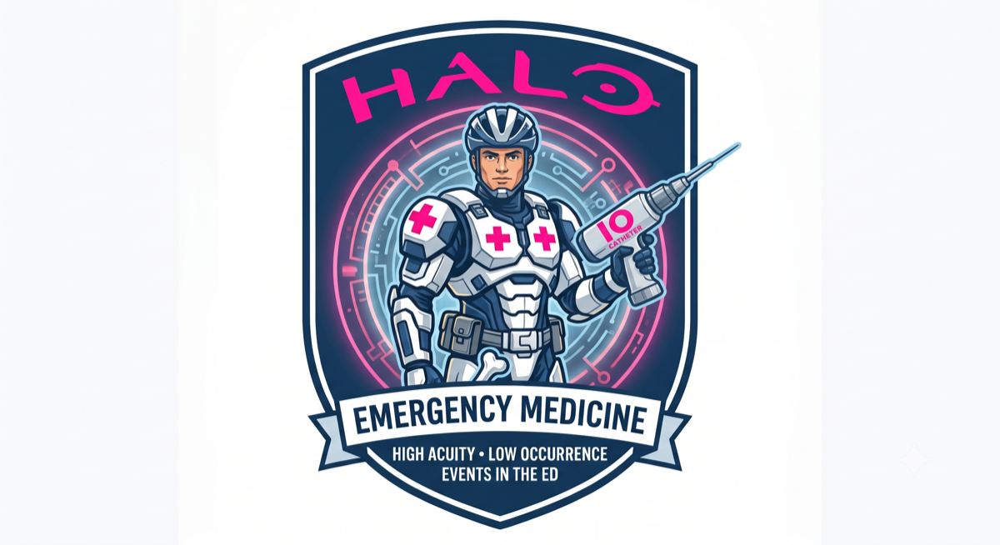

<p align="center">
  
</p>

# HALO

[](https://github.com/GOATnote-Inc/HALO/actions/workflows/ci.yml)

**HALO — High Acuity, Low Occurrence.** An open-source, evidence-linked EHR module class for
the rare, high-stakes events clinicians can't practice daily. Module 1: **Mass Casualty
Incident (MCI) triage support** — built live at the *Future of Agentic AI in Healthcare*
hackathon (Abridge × Anthropic × Lightspeed), San Francisco, 2026-07-18.

**Synthetic data only. Research demonstration — not a medical device.** Full medical, legal,
and ethical posture: [docs/GOVERNANCE.md](docs/GOVERNANCE.md).

## The problem

When a mass casualty event hits, the EHR fails in the same ways every time — the published
after-action record is consistent:

- **Las Vegas, Route 91 (2017):** hundreds of penetrating-trauma patients arrived by private
  vehicle with no EMS tag, no identity, no registration; staff fell back to markers and
  improvised labels (Menes et al., *Emergency Physicians Monthly*, 2017).
- **Boston Marathon bombing (2013):** unknown-patient naming, tracking, and documentation were
  the dominant information-system failures at a fully-EHR'd academic center (Landman et al.,
  *Ann Emerg Med* 2015;66(1):51–59).
- **Beirut port explosion (2020):** several hundred casualties in ~two hours at a single
  academic center; identification chaos and paper documentation, per published AUBMC accounts.

Yet in most emergency departments today, MCI triage support is an opaque vendor feature, a
paper form, or one staff member who knows the disaster binder. HALO's position: this layer
should be **open source, inspectable, evidence-linked, and free to every ED on earth**.

**Built for the triage nurse.** Door triage in an MCI is a nursing workflow — even the largest
trauma centers run a handful of physicians per shift, and when 100+ patients present, nurses
sort at the door with START ("30-2-Can Do") and SALT while physicians staff the resuscitation
bays. HALO meets that reality: one spoken-style note per patient, numbers over judgments
(a charted RR ≥ 30 deterministically fails the breathing screen, and the derivation is
reported), and expectant designation existing **only** as a physician decision at secondary
triage. The full workflow map: [docs/WORKFLOW.md](docs/WORKFLOW.md). The Epic/FHIR
incorporation path (SMART on FHIR launch, alias-record write-back, CDS Hooks flags, and the
chart-bloat contract): [docs/INTEGRATION.md](docs/INTEGRATION.md).

## What it does

**One product surface: the ED board** — the track board every emergency department already
lives in, extended for the hour it breaks. Triage is an area of the same board (patients
T01+, quick-reg MRNs), rooms A01–C11 beneath it, chairs, departed, and the audit trail on
one page. Everything below happens on that surface or one click from it.

1. **Surge bed clearance (reverse triage)** — at declaration, a deterministic rule table
   (Kelen et al., *Lancet* 2006) classifies every occupied room: discharge now / move to
   chairs / expedite admission (two-phase inpatient pull) / hold. Missing data = don't move.
   The demo census frees 17 beds by ED action alone, 4 more on pull — against 100+ inbound.
   No model call; milliseconds.
2. **One-click door triage** — click Triage on a queue patient: a chart opens, Claude
   extracts SALT observations from the free-text note (verbatim evidence quotes, nulls for
   the undocumented, RR≥30 derives the failed breathing screen per START "30-2-Can Do"),
   and deterministic SALT code assigns the category. The result auto-records to the queue
   row, which presents its legal routings: resus bay, trauma bay, or an ED bed — consuming
   the capacity the surge plan just freed. Routing before triage refuses, citing EMTALA.
   EXPECTANT exists only as a physician decision at secondary triage.
3. **Medical agent — chart reconciliation** — for garbled identity ("last name sounded like
   *Wilkerson*… takes a blood thinner"), a bounded Claude agent (SDK tool runner) searches
   the FHIR panel with name variants and corroborates against chart content. It only
   *proposes*: every candidate is re-verified deterministically, capped at "possible," and
   labeled UNCONFIRMED — a human merges charts. Matched candidates surface care-modifier
   flags with provenance (clopidogrel → occult-hemorrhage risk on a head strike).
4. **Legal agent — compliance review** — a second Claude agent audits the board's live
   audit trail against five cited rules (EMTALA 42 USC 1395dd screening; IOM Crisis
   Standards 2012 documentation and accountability; identity-merge governance; fail-closed
   overrides). Every finding must quote the real log verbatim — fabricated evidence is
   dropped *and counted on screen*. In its first live run it caught a genuine logging gap.
5. **Staff readiness (CME)** — just-in-time "?" links surface procedure cards in the
   clinical flow (a rock-hard proptotic orbit in a triage note links the lateral-canthotomy
   card), plus a **simulation lab**: five interactive 2D patient simulations with a live
   monitor, landmark diagrams, and evidence-cited debriefs structured to physician /
   nursing / EMS learning objectives — including the IO-site case where a tibial line in
   penetrating abdominal trauma pours the resuscitation into the belly and the proximal
   humerus saves the patient.
6. **FHIR in, FHIR out** — the panel is standard FHIR R4; the triage result writes back as
   one coded Observation on the MCI alias record (no narrative bloat, candidate data
   deliberately excluded). Integration path: SMART on FHIR launch, CDS Hooks flags
   ([docs/INTEGRATION.md](docs/INTEGRATION.md)).

The agent design follows Anthropic's building-effective-agents doctrine — workflows where
the path is known, agents only where open-ended exploration pays, and a deterministic
verification layer over every agent output. Full inventory: [docs/AGENTS.md](docs/AGENTS.md).

## The safety case

| Failure mode | Behavior |
|---|---|
| Note doesn't document breathing | `UNABLE_TO_TRIAGE` — assess in person immediately |
| Life threat can't be ruled out | `UNABLE_TO_TRIAGE`, never a guess |
| Injury extent unknown after clean screen | Defaults **up** to `DELAYED` — never downgrade on missing data |
| Model refuses / output truncated | `LLMFailure` raised; partials never parsed (`halo.llm`) |
| Resource-based abandonment (`EXPECTANT`) | Only via explicit human `likely_survivable=false` |
| Agent proposes a hallucinated patient ID | Discarded at deterministic re-verification |
| Demographics-only identity match | Capped below "strong" — a name cue is required |
| Any identity match | At most a *candidate*; confirmation is a human act |

**Cardinal metric: under-triage false negatives = 0.** Current results on the synthetic
goldset (N=12 notes, claude-opus-4-8, single run, method in `src/halo/mci/demo.py`):
11/12 category agreement, **0 under-triage FNs**, 78/84 extraction fields correct; the sole
disagreement was safe-direction over-triage. 275 offline tests (including full input-space totality sweeps over the triage and
surge rule tables) gate CI.

## Quickstart

```sh
git clone https://github.com/GOATnote-Inc/HALO.git && cd HALO
make setup          # venv + deps
make check          # ruff + pytest, offline — must be green
cp .env.example .env  # add ANTHROPIC_API_KEY (never committed)
```

Live surfaces (need `ANTHROPIC_API_KEY`):

```sh
.venv/bin/python -m halo.mci.demo            # goldset eval: extraction + triage + FN gate
.venv/bin/python -m halo.mci.demo --handoff  # 4 scripted end-to-end scenarios (see below)
.venv/bin/python -m halo.mci.demo --surge    # offline: reverse-triage the census, print plan
make serve                                    # then open http://127.0.0.1:8000
```

The web UI at `/` is a single dependency-free HTML page (works on a hospital intranet with no
internet), presented the way an ED actually works: an **ED track board** (the census, ESI,
care tethers, and the surge action per bed) plus a **door triage** tab (paste or pick a field
note, run the handoff, read the evidence-quoted observations, identity candidates with care
flags, the agent tool trail, and the FHIR write-back preview).

The three scripted scenarios mirror the published failure modes:

1. **Route 91 pattern** — self-transported, partial identity, head strike; resolves
   deterministically and surfaces the clopidogrel occult-hemorrhage flag.
2. **Beirut pattern** — bystander-reported phonetic name; the agent loop tries variants,
   corroborates "blood thinner" against the chart, and proposes a candidate capped at
   *possible* — including a documented-hospice goals-of-care flag.
3. **Fail-closed showcase** — a sparse note; the system escalates rather than guesses.

## Repo map

| Path | What it is |
|---|---|
| `src/halo/llm.py` | The only Claude seam: model knob (`HALO_MODEL`, default `claude-opus-4-8`), adaptive thinking, structured outputs, bounded agent loop, fail-closed policy. |
| `src/halo/mci/` | Module 1: `extract` (note → observations), `triage` (deterministic SALT + 30-2-Can-Do derivation), `panel` (FHIR panel, scoring, flag rules), `reconcile` (agentic identity), `census` + `surge` (track board, reverse triage), `fhir_out` (FHIR R4 write-back bundle), `scenarios`, `demo`. |
| `src/halo/app.py` | FastAPI: web UI at `/`, `POST /mci/handoff`, `POST /mci/triage/*`. |
| `src/halo/static/` | The dependency-free demo UI. |
| `synthetic-ambient-fhir-25/` | Abridge-provided fully synthetic FHIR R4 panel (25 patients). |
| `tests/` | Offline tests + synthetic goldset — no network, no key. CI-gated. |
| `docs/AGENTS.md` | The agent inventory: medical (chart reconciliation) and legal (compliance) agents, plus the workflows deliberately kept simpler — mapped to Anthropic's agent doctrine. |
| `docs/GOVERNANCE.md` | Medical, legal, and ethical posture; AI risk register; limitations. |
| `docs/WORKFLOW.md` | Who actually does MCI triage (nurses) and where each surface sits. |
| `docs/INTEGRATION.md` | Epic/FHIR incorporation: SMART launch, alias write-back, CDS Hooks, chart bloat. |
| `CLAUDE.md` / `STATUS.md` | Working charter and live multi-terminal coordination board. |

## Working agreements

Several agent terminals work in this repo concurrently (full rules in [CLAUDE.md](CLAUDE.md)):
claim a lane in [STATUS.md](STATUS.md) first; stage files by name; `git pull --rebase` +
`make check` before every push; synthetic data only; never read or print `.env` contents.

## Scope & claims

Research demo built in one day. **Synthetic data only — no real patient data.** Not a medical
device; no clinical validation; nothing here is clinical advice. A production version would
require the regulatory pathway discussed in [docs/GOVERNANCE.md](docs/GOVERNANCE.md), clinical
validation, and qualified professional review. Metrics, when reported, include N and method.

## License

[Apache-2.0](LICENSE)
